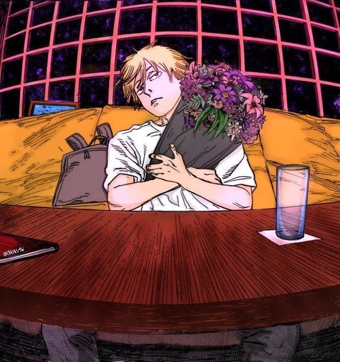

# CS 5500 Fall 2024 - Team () => lol 

- Welcome to the landing page of our team.
- **Team Name:** () => lol
- **Team Logo:** 
- **Team Description:** Built to compile pain into laughter, but mostly just pain.

## Team Members
| Image | Name | Email |
|-------|------|-------|
|  | PP | page10rock@gmail.com |
|  | Lionel | xuetao.li168@gmail.com |
|  | Hippo | hippo@example.com |
|  | Shark | shark@example.com |

## Assigned TA
Your TA will be one of these:

| Image | Name | Email |
|-------|------|-------|
|  | Cat | email |
|  | Dog| email |

## Weekly Stand-Up Time
- [Place holder for the assigned time for the weekly stand up with TA]

